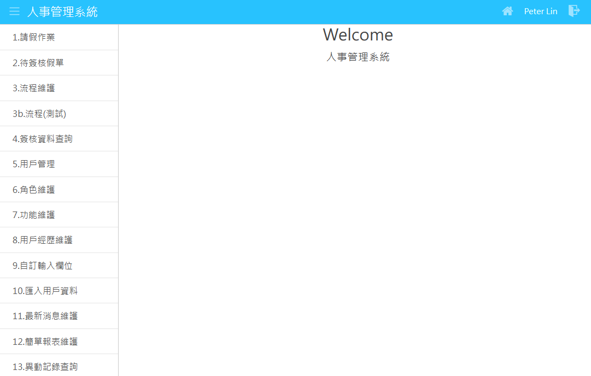

其他语系：[繁中](Readme-TW.md)、[英文](Readme.md)

### 1.专案介绍
HrAdm 是一套简单的人事管理系统，使用的开发工具为ASP.NET Core 6、jQuery 3、Bootstrap 5、Visual Studio 2022 Community，它用来介绍Web 系统常见的功能和实作方式，这些功能整理如下：
- CRUD：单个或多个资料表的新增、查询、修改、删除功能。
- 自订输入栏位：SSR MVC 自订输入栏位。
- 权设设定：设定使用者、角色、功能以及可以存取的资料范围。
- 汇出 Word 档案：使用范本将资料汇出 Word 档案。
- CMS（Content Management System）：以简便的方式来维护各种 CMS 资料。
- 签核流程功能：流程设计、建立和应用。
- 简单报表：以简单的方式来处理大量的报表需求。
- 资料库异动记录：记录和查询资料库的异动内容。

HrAdm 的主画面如下：

### 2.操作画面
进入主画面后，左侧功能表有13个功能项目：
1. [请假作业](_md/zh-CN/Leave.md)：建立假单
2. [待签核假单](_md/zh-CN/LeaveSign.md)：签核假单
3. [流程维护](_md/zh-CN/XpFlow.md)：维护流程资料
4. [签核资料查询](_md/zh-CN/XpFlowSign.md)：查询签核资料
5. [用户管理](_md/zh-CN/User.md)：维护用户、用户角色资料
6. [角色维护](_md/zh-CN/XpRole.md)：维护角色、用户角色、角色功能资料
7. [功能维护](_md/zh-CN/XpProg.md)：维护功能、角色功能资料
8. [用户经历维护](_md/zh-CN/UserExt.md)：维护用户经历资料
9. [自订输入栏位](_md/zh-CN/CustInput.md)：维护自订输入栏位资料
10. [汇入用户资料](_md/zh-CN/UserImport.md)：汇入用户资料
11. [最新消息维护](_md/zh-CN/CmsMsg.md)：维护最新消息资料
12. [简单报表维护](_md/zh-CN/XpEasyRpt.md)：维护简单报表资料
13. [异动记录查询](_md/zh-CN/XpTranLog.md)：查询资料库的异动记录

### 3.下载 & 安装
执行 HrAdm 需要从 GitHub 下载以下两个 Repo 档案，解压缩到本机目录，并且确保 HrAdm 可以正确参照 BaseWeb 专案：
 - Base：包含 Base、BaseApi、BaseWeb、BaseEther 四个专案，内容为基本的公用程式。 HrAdm 必须参照 BaseWeb 专案，下载的网址为 https://github.com/bruce68tw/Base
 - HrAdm：内容为 HrAdm 主程式。

### 4.目录说明
以下是 HrAdm 专案下的目录，其中底线开头的目录表示特殊用途：
 - _data：包含许多工作档案，其中createDb.sql 用来建立本系统的资料表以及产生资料内容；Tables.docx是利用本系统所产生的资料库档案。
 - _log：系统运行所产生 Log 档案。
 - _template：各种功能所需的范本档案。
 - Controllers：Controller类别档案。
 - Enums：列举类别，如果档案名称结尾是Enum表示是数字型，如果是Estr，则表示为字串型，例如：InputTypeEstr.cs
 - Models：系统所需要Model类别，档案名称后面为Dto表示Data Transfer Object，Vo表示 View Object
 - Resources：多国语资料档案，这里用于View页面。
 - Services：服务类别。
 - Views：网页档案。
 - wwwroot：Web 前端 CSS、JavaScript 档案。
 - Tables：使用 Database First 所产生的 Entity Model。

### 5.组态设定
HrAdm/appsettings.json 里面的 FunConfig 区段记录系统执行时所需要的组态内容，
它包含以下的栏位：
 - Db：标准的资料库连线字串，用于 ADO.NET 和 Entity Framework，并且加入 MultipleActiveResultSets=True 让每一次连线可以多次存取资料库。
 - Locale：指定的多国语语系，目前允许的输入值分别为：zh-TW（繁体中文）、zh-CN（简体中文）、en-US（英文），设定这个栏位，执行时系统即会呈现不同的语系。
 - LogSql：是否记录SQL的内容到 Log 档案，预设false，所有Log档案会存放在 _log 目录底下，这一类的档案名称后缀为 sql。

### 6.建立资料库
HrAdm 的资料库名称为Hr，种类为LocalDB、SQL Express、MS SQL 皆可，进入SQL Server Management Studio（SSMS），建立一个空白的资料库Hr，然后执行HrAdm/_data/createDb.sql，这个档案会建立以下的资料表和内容：
- Cms：CMS（Content Management System）设定资料
- CustInput：自定输入栏位资料
- Dept：部门资料
- Leave：假单资料
- User：用户基本资料
- UserJob：用户工作经验
- UserLang：用户精通语言
- UserLicense：用户取得证照
- UserSchool：用户学历资料
- UserSkill：用户特殊技能
- XpCode：杂项档，这个资料表用来储存Key-Value的对应资料，名称加上Xp表示系统用途。
- XpEasyRpt：快速报表设定资料
- XpFlow：流程设定资料
- XpFlowLine：流程线设定资料
- XpFlowNode：流程节点资料
- XpFlowSign：包含所有流程的签核资料
- XpImportLog：汇入资料纪录
- XpTranLog：资料异动纪录
- XpProg：系统功能基本资料
- XpRole：角色基本资料
- XpRoleProg：角色功能资料
- XpUserRole：用户角色资料

### 7.参与专案
您可以透过以下方式来参与本专案：
 - 反映系统问题：[GitHub Issues](https://github.com/bruce68tw/HrAdm/issues)
 - 修改程式并且提交请求：[Pull Request](https://github.com/bruce68tw/HrAdm/pulls)
 - 到[脸书](https://www.facebook.com/groups/softblocks)参与讨论。
 - 赠送 GitHub Star。
 - 购买[书籍](https://www.tenlong.com.tw/products/9789865029883)。

### 8.作者
 - Bruce Chen - *Initial work*

### 9.版权说明
本专案使用 [MIT 授权许可](https://zh.wikipedia.org/zh-cn/MIT许可证)。